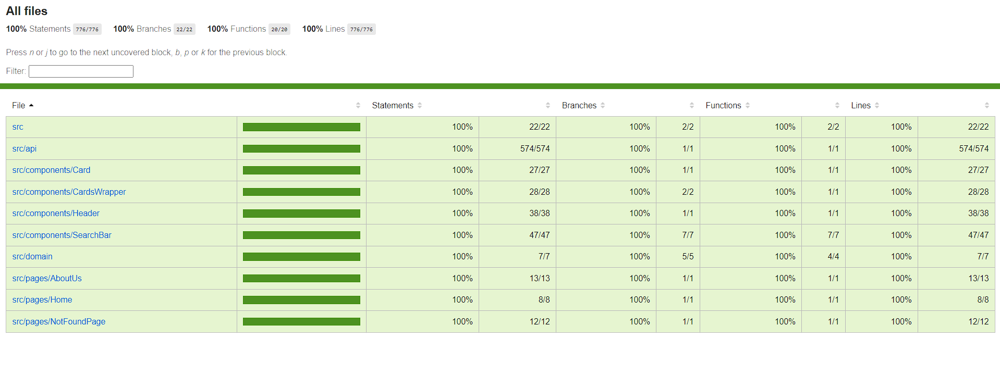

# RSS React course.

**##** Deployment

**-** [**React Components**](https://react-module1.netlify.app/)

**##** Run Locally

Clone the project

```
git@github.com:mskmee/rss_react.git
```

Go to the project directory

```
cd rss_react
```

```
cd rss_react
```

Install dependencies

```
npm i
```

Start the server

```
npm run start
```

Tests coverage

```
npm run coverage
```

**##** Build

To build this project run

```
npm run build
```

**##** Running Tests

To run tests, run the following command

```
npm run test
```

Test coverage:


